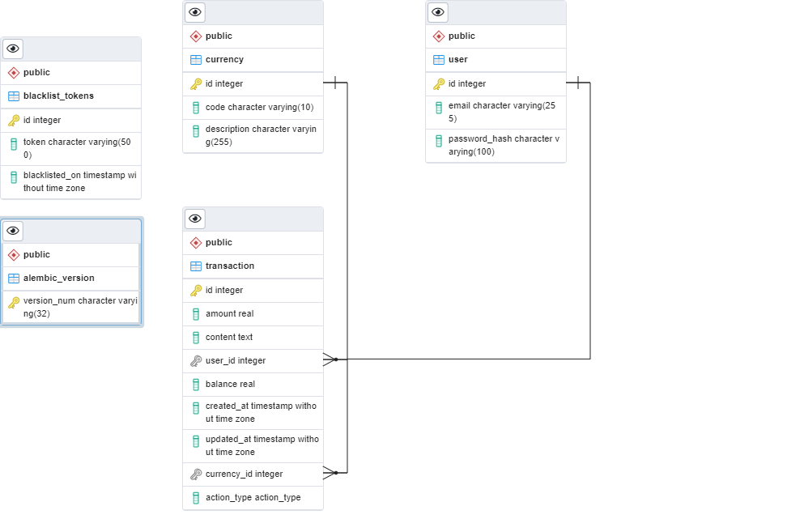

# Python-Flask-RESTful-APIs
The following features are included in the application:

* Flask: `flask version 2.0.1`
* PostgreSQL: `psql (PostgreSQL) 13.3`
* API documentation using the OpenAPI 3 specification and Swagger UI

## Database
### ERD


## API Resource

### Auth user resource

```
POST   /api/v1/register
POST   /api/v1/login
GET   /api/v1/logout
```

### Transaction resource 
```
GET    /api/v1/transaction/
POST   /api/v1/transaction/add
PUT    /api/v1/transaction/update
POST   /api/v1/transaction/filter/date
```

### Schema
- File: `database/schema.sql`
- Create database with name `db_flask`
- Run schema: `psql db_flask < database/schema.sql`

## Setup

To set up the application, you need Python 3. After cloning the repository change to the project directory and install the dependencies via:
```
cd CashierAPI
Create python environment: `python -m venv venv`
Activate python environment : `source venv/bin/activate`
Install package `pip install -r requirements.txt`
Run project `flask run`

```

Now the application is served on `localhost:5000/docs`.
